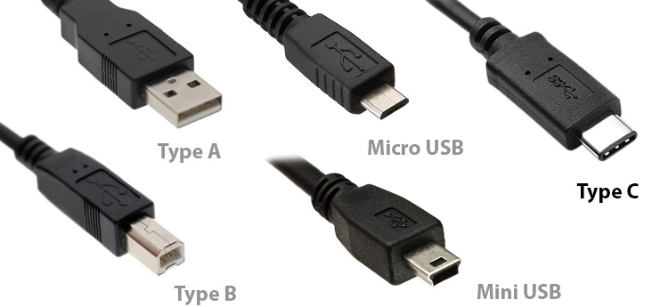

# 🧵 Kabelmanagement – Farblegende 

git clone https://github.com/dajuly20/scan-new-usb-connections
cd scan-new-usb-connections 

# USB-Geräte auflisten
./scanusbconnections --list-cli

# USB-Überwachung starten (Terminal)
./scanusbconnections --watch-cli

# GUI-Version starten
./scanusbconnections --gui

*Quelle: ChatwGpt Chat „🧵 Kabelmanagement (Farblegende, aktueller Stand)"*

🧵 Kabelmanagement – Farblegende (aktueller Stand)

| Farbe / Symbol | Bedeutung |
|----------------|-----------|
| 🟦 Blau        | USB-A |
| ⚫ Schwarz     | USB-B quadratische "Druckeranschlüsse" |
| 🟨 Gelb        | USB-C |
| 🟥 Rot         | USB-Mini |
| 🟪 Lila        | USB-Micro |
| 🟥 Rot         | USB-Mini größér als Mini aber langlebiger |
| 🟨🟩 GrünGelb (PE) | USB PD 5 / 9V / 12V / 20V USB → DC-Anschluss (Barrel Jack), alternative Farbkombination für bessere Unterscheidung |
| 🟧 Orange      | USB-PD Kabel mit Schalter (Universal Power Delivery, 5–20V umschaltbar) |
| 🟨 + 🔁        | USB-C Verlängerungskabel (beide Enden gelb, zusätzlich Wiederholungs-Symbol) |

| Farbe / Symbol  | USB - Gen | Bedeutung |
|-----------------|---------|-----------|
| ( 🟨🟩 GrünGelb (PE) |  PD und so? Is dann niicht automatisch jedes USB3 = alle stufen? ?) 
| 🟨⚡3️⃣          | 3.0     | wenn nötig damit man Stift sieht gerne noch eine (gelbe) Banderole,dann kann man ne "3" nen Blitz drauf mahlen. |                            
| ⬜🐌2️⃣  | 2.0      |  wenn'S nötig ist ne graue Banderole und 2 draufschreiben. Wenn du ne Schnecke malen kannst - gerne! |
| ⬜  ❌  |  o. Daten |  Qucickcharge - Nur 5V Ladekabel ohne Datenverbindung. Wenn'S noch genug andere gibt am besten sofort in die Tonne |
|          |          | damit!|

---

## USB 3 Port-Farben (Herstellerstandard)

Die **internen Farben** der USB-Ports geben Hinweise auf die USB-Generation:

| Port-Farbe (innen) | USB-Version | Geschwindigkeit |
|--------------------|-------------|-----------------|
| ⬜ Weiß            | USB 1.x     | 1.5–12 Mbit/s   |
| ⬛ Schwarz         | USB 2.0     | 480 Mbit/s      |
| 🟦 Blau            | USB 3.0 / 3.1 Gen 1 | 5 Gbit/s (SuperSpeed) |
| 🩵 Türkis/Teal     | USB 3.1 Gen 2 | 10 Gbit/s (SuperSpeed+) |
| 🟥 Rot             | USB 3.2 Gen 2x2 / Sleep-and-Charge | 20 Gbit/s / Laden im Standby |
| 🟨 Gelb / 🟧 Orange | Always-On Port | Laden auch bei ausgeschaltetem PC |

> **Hinweis:** Gelb/Rot bei USB 3 Ports bedeutet oft spezielle Ladefunktionen (Always-On oder Sleep-and-Charge), nicht unbedingt höhere Geschwindigkeit.

